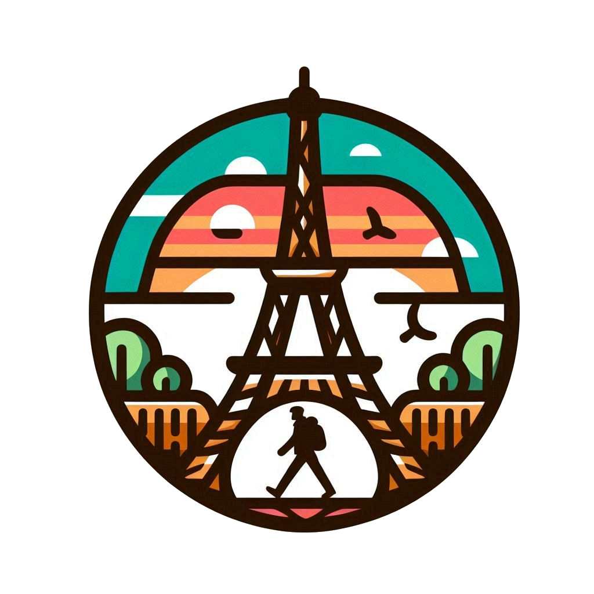

 

# What's Up Paris ?

What'up Paris is a website to search for tourist information (entertainment, cinema, art, ...)

It build with React.js and TypeScript and powered by Next.js framework

## Installation

Use the package manager [npm](https://www.npmjs.com/) to install the web application.


```bash
npm ci

npm run dev
```

Open [http://localhost:3000](http://localhost:3000) with your browser to see the result.
